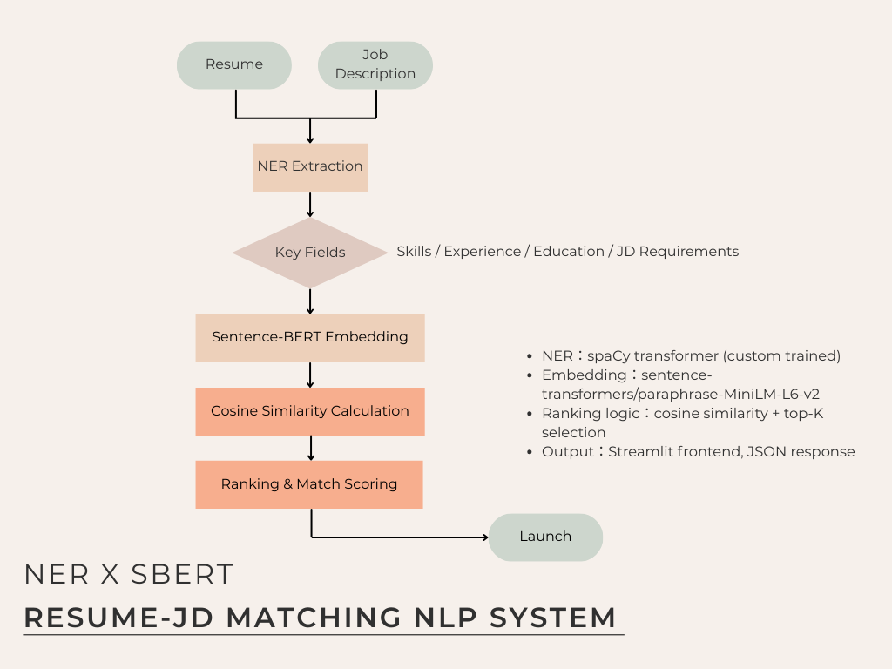

This project implements an NLP-based system to match resumes with job descriptions. By analyzing textual similarities and key term alignments, the model aims to streamline the recruitment process through automated candidate-job matching.

# 📌 NLP Resume-JD Semantic Matching 專案成果展示

## 📘 專案簡介
本專案旨在模擬真實人力媒合系統，透過自動生成之履歷與職缺資料進行命名實體辨識（NER）訓練，並結合語意嵌入與相似度評估技術，達成履歷與職缺間的智能匹配推薦。

---

## 🔖 Why this project matters：
This project simulates a real-world HR screening engine by matching resumes to job descriptions using transformer-based NER and semantic similarity.
It demonstrates how NLP can reduce recruiter bias and improve talent discovery through transparent, skills-based alignment.

---
## 🧭 System Architecture

--- 

## 📌 模型訓練成果摘要

### 🔹 JD NER 模型表現
| 指標       | 數值   |
|------------|--------|
| ENTS_F     | 0.51   |
| ENTS_P     | 0.76   |
| ENTS_R     | 0.38   |
| 模型       | model-best (transformer fine-tuned) |

### 🔹 Resume NER 模型表現
| 指標       | 數值   |
|------------|--------|
| ENTS_F     | 0.30   |
| ENTS_P     | 0.43   |
| ENTS_R     | 0.23   |
| 模型       | model-best (transformer fine-tuned) |

---

## 📌 語意匹配推薦系統評估指標 (Top-3)

### 🔹 Recommendation Evaluation
| 評估指標     | 數值   |
|--------------|--------|
| Precision@3  | 0.410  |
| MAP@3        | 0.367  |
| NDCG@3       | 0.549  |

- 評估方式：對每個 JD 推薦前 3 筆履歷，並依人工標記結果計算上述指標。
- 工具腳本：`eval_metrics.py`

---

## 📌 技術亮點摘要

- 🔧 **SpaCy Transformer 微調 NER 模型**  NER: spaCy transformer-based model to extract key fields
- 🧠 **SBERT 語意嵌入產生語句向量**  SBERT: Word embeddings
- 📊 **KMeans 聚類評估語意結構品質**  Unsupervised Clustering: KMeans for job-resume grouping
- 📈 **TF-IDF / BM25 / SBERT 三法匹配比較**  Similarity Matching: Sentence-BERT, TF-IDF, and cosine similarity
- 💡 **具可解釋性的履歷推薦邏輯** Output: Top-K ranked JD matches for each resume

---

## 📁 推薦結果範例（JD ➜ Top-3 Resumes）

📄 *可參考檔案：* `top_k_recommendations.csv`

| JD內容摘要                      | Top1履歷         | Top2履歷         | Top3履歷         |
|--------------------------------|------------------|------------------|------------------|
| Backend工程師需熟Python與API設計 | 張O倫（Python）  | 林O妤（Flask）   | 陳O宇（Django）  |

---

## 🧠 未來可擴充方向
- 加入更多履歷/職缺數據擴大訓練集
- 結合 LLM 模型實現語意問答或推薦解釋
- 前後端部署可視化推薦平台（Streamlit + FastAPI）

---
作者：Debby Yeh｜專案完成日：2025年3月

## 🔗 Related Links
- 📝 [Medium post: Building a Resume-JD Semantic Matching System](https://medium.com/@debby.yeh1994)
- 📂 [Notion Portfolio](https://mango-mapusaurus-5df.notion.site/Debby-Yeh-NLP-Application-Engineer-Portfolio-1ca5118474d2801caa58de564fb53e38?pvs=4)
